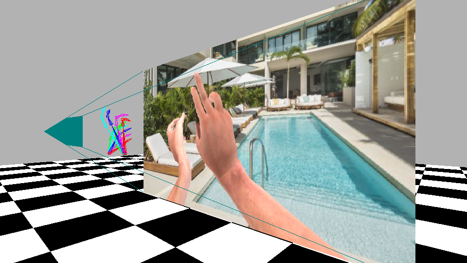

# Ego3DHands
    

    

Ego3DHands is a large-scale synthetic dataset for the task of two-hand 3D global pose estimation. It provides images and corresponding labels with the presence of two hands in egocentric view generated using Blender. This dataset can also be used for the task of hand segmentation, 2D, 3D canonical hand pose estimation. For hand tracking in dynamic sequences, we provide a dynamic version of Ego3DHands. This dataset is introduced by our paper [Two-hand Global 3D Pose Estimation Using Monocular RGB](https://arxiv.org/abs/2006.01320).

Each instance provides the following data for both hands:
  * Hand image with transparent background
  * Hand image with background
  * Segmentation masks 
    * 15 classes with the following labels:
      * 0: Background
      * 1: Arm (1~7 is for the left hand)
      * 2: Palm
      * 3: Thumb
      * 4: Index finger
      * 5: Middle finger
      * 6: Ring finger
      * 7: Pinky
      * 8~14: Repeats the order from class 1 to 8 for the right hand.
  * Depth image 
    * Enocded as RGB images such that Depth_val = 1.0xB_val + 0.01xG_val + 0.0001xR_val (cm). Background has value of 0s.
  * 2D joint locations 
    * There are a total of 22 joints for each hand. The ndarray has shape of (2, 22, 2), where the first dimension is for the left and right hand, second dimension is for the 22 joints and third dimension is for row and column percentage value. Top left is (0.0, 0.0) and bottom right is (1.0, 1.0).
      * 0: Elbow (usually not used and can be ignored)
      * 1: Wrist
      * 2~5: Thumb
      * 6~9: Index finger
      * 10~13: Middle finger
      * 14~17: Ring finger
      * 18~21: Pinky
  * 3D global joint locations
    * The ndarray has shape of (2, 22, 3), where the first and second dimension is the same as 2D ndarray, the third dimension is for (row, col, depth). Row value increases going down, column increases going to the right and depth increases going away from the view.
    * Normalized such that the bone length from wrist to the mMCP has length of 10.0cm
  * 3D canonical joint locations 
    * 3D global joint locations spherically rotated to center the middle metacarpophalangeal joint (mMCP), zero-centered on mMCP (root joint) and normalized so the bone formed by the wrist joint and mMCP (key bone) has length of 1.0). 
    * Unlike common methods that generate the canonical poses by simply translating the absolute root joint to the origin, we spherically rotate the joint locations to align the root joint to the center of the view so the visual representation of the hand poses are consistent with the 3D canonical joint locations. In other words, hand poses that have the same visual representation at different global locations should have the same 3D canonical joint loations.

Note that some instances only have a single hand present.

# Ego3DHands static & dynamic
Ego3DHands dataset provides 2 different versions for the task of static and dynamic pose estiamtion respectively. The static version includes 50,000 training instances and 5,000 test instances. The background images for the static version are randomly selected from approximately 20,000 images within 100 different scene categories from online sources. Additionally, the background images are randomly flipped horizontally and color augmented. The dynamic version includes 100 training videos and 10 test videos with 500 frames per video sequence. Each sequence has a unique background sequence selected from www.pexels.com.

# Download
Please use the following links for downloading the datasets:

Ego3DHands (static):
https://byu.box.com/s/j5a27ilrxraz94ujlvg3gzf715fiq8ih

Ego3Dhands (dynamic):
https://byu.box.com/s/wtib1zbtmzu9wbwbw1miw8q1oivdbyx6

# Evaluation
For the task of global hand pose estimation, we evaluate in terms of both the AUC for the PCK of the 3D canonical hand poses (pose accuracy) and a new metric of the AUC of the spherical PCK of the root joint that computes the distance accuracy and directional accuracy. Please see our paper for more details.

# License
This dataset can only be used for scientific/non-commercial purposes. If you use this dataset in your research, please cite the corresponding [paper](https://arxiv.org/abs/2006.01320)

